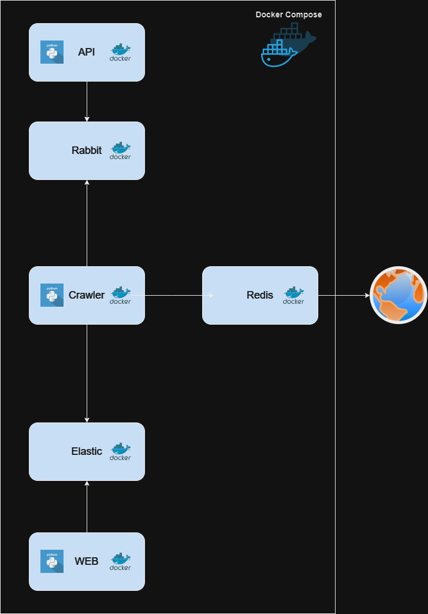
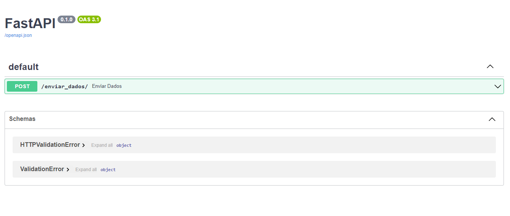
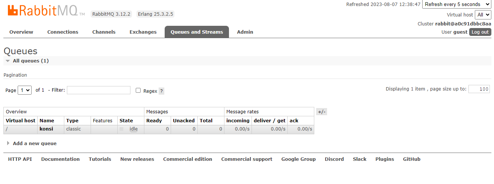

# Konsi - Desafio
Desenvolvedor: Ronald Maldonado

## Desafio:
A Konsi coleta uma variedade de dados que não são facilmente acessíveis, para propor melhores opções de créditos para seus clientes. Um dos tipos de dados coletados é o número da matrícula do aposentado ou pensionista.
O desafio é fazer uma API que busque e retorne a matrícula do servidor em um determinado portal.
Será necessário desenvolver um crawler para coletar esse dado no portal e uma API para fazer input e buscar o resultado depois.

## Tecnologias:
- Python
- Elasticsearch
- Redis
- RabbitMQ
- Docker

## Estrutura:
#### Konsi.API
API responsável em receber um numero de CPF e enviar para o serviço de mensageria RabbitMQ.

#### Konsi.Web
Pagina simples HTML que faz a busca de uma matricula no Elasticsearch.

#### Konsi.Crawler
Crawler responsável em ficar observando a fila do serviço de mensageria, ao receber um novo CPF, o crawler verifica a sua existencia em um cache REDIS, caso não encontre no cache, o mesmo vai ate o portal da Konsi realizar a consulta e extração da matricula referente a esse documento CPF. Para finalizar o processo é feito a persistencia das matriculas no Elasticsearch.

#### Konsi.Teste
Esse projeto foi criado apenas para criar uma carga de CPF na fila do RabbitMQ. Não necessário e fora do escopo do desafio.

#### docker-compose.yml
Arquivo compose para subir todos os serviços:
- APi
- SITE
- CRAWLER
- RABBITMQ
- REDIS
- ELASTICSEARCH

## EXECUTAR O PROJETO:
Todos os serviços são criados a partir de um docker-compose. Sendo necessário apenas executar o comando:

### docker-compose up -d

OBS: Todos os serviços são iniciados com uma imagem docker, não sendo necessário o codigo fonte. O fonte é apenas para analise e caso queira executar individualmente cada projeto. Dentro de cada projeto tem o seu respectivo dockerfile responsável pela imagem que ja está hospedada publicamente na minha conta do Docker-Hub.

## ACESSANDO O PROJETO:

#### API
http://localhost:8000/docs

#### WEB
http://localhost:5000

#### RabbitMQ
http://localhost:15672/
Username: guest
Password: guest

